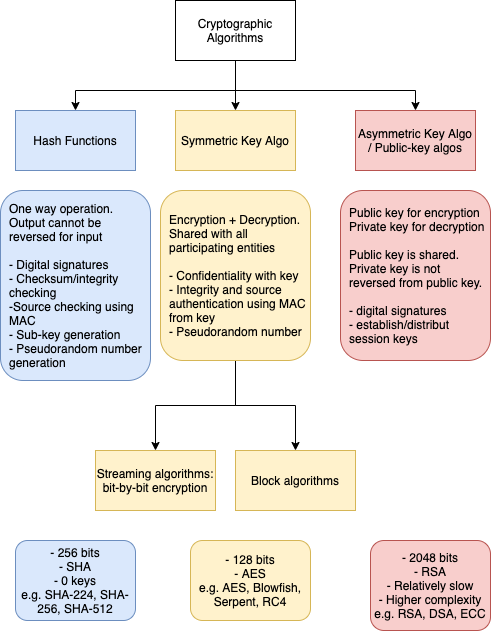
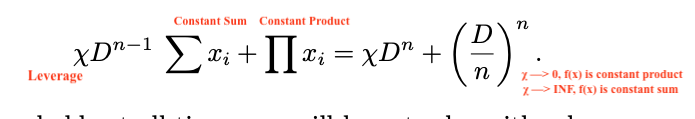
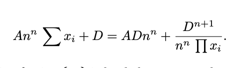
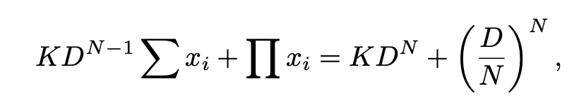
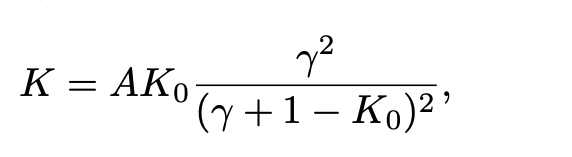
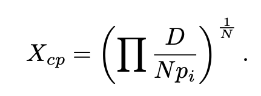

# Sprint 2 - 06/07

## Gary Gensler. MIT 15.s12

Goldman Sachs, US Treasury, MIT, SEC chairmain (2021)

- [x] [3.](https://www.youtube.com/watch?v=0UvVOMZqpEA) Blockchain Basics and Cryptography
    - [x] Cryptographic primitives: **(1) hash functions** for tamper resistance/integrity and (2) **digital signatures using asymm encryption** for  consent. 
    * Blockchain primitives - crytography and consensus
    * components of a block: 
        * Header: hash of previous block + timestamp + nonce + **merket root hash**
        * Own Hash Header
        * Txn list    
    * Solving the puzzle: having a **certain number of leading zeros**. It doesn't mean having the exact, identical hash. 
    
    >
    > The proof-of-work involves scanning for a value that when hashed, such as with SHA-256, the
hash begins with a number of zero bits.
    >
    > Avg work required is exponential to the number of zero bits required. W=e^n
    > Merkle tree is a binary tree of hashes.
    * Merkle tree: [hash of hashes of blocks](https://www.investopedia.com/terms/m/merkle-root-cryptocurrency.asp) for quick, mathematical verification
    * The [merkle root of a block](https://www.youtube.com/watch?v=V6gLY-1G4Mc), which is the hash of all hashes of all txns, contains info on all txns in the block.
    * One branch of a hash tree can be donwloaded and verified immediately even without the whole tree. Only small blocks of data need to be redownloaded and quickly checked. 
    * Any modified txn will change the value of the Merkle root of the block, and so the integrity of the block.
    * For an odd # of txns (2n-1) in a block, the last txn pair is duplicated for L1 hash to have 2 leafs
    * Digital signatures and asymmetric encryption: public + private key
    - Bitcoin addresses are not simply public keys to the private keys. 
    - **Bitcoin addresses = base58(public key x SHA256() x SHA256() + checksum)**

- [x] Cryptographic algorithms [overview](https://www.cryptomathic.com/news-events/blog/differences-between-hash-functions-symmetric-asymmetric-algorithms)
    * 
    * Bitcoin uses ECDSA algorithm for asymm encryption - more mathematically complex than RSA. 
        - [x] [ECDSA](https://en.bitcoin.it/wiki/Elliptic_Curve_Digital_Signature_Algorithm) in bitcoin wiki 
        * Uses finite fields and a curve function [Secp256k1](https://en.bitcoin.it/wiki/Secp256k1)
        * private key: single unsigned 256 bit integer
        * public key: compressed keys with prefix of `0.x02` and 256-bit integer
        * signature: a number generated from a hash + private key (signing algorithm). public key can be used to determined the signature was produced from the has and private key (verification algorithm), without knowing the private key. 
        - [ ] [MOAR](https://medium.com/@blairlmarshall/how-does-ecdsa-work-in-bitcoin-7819d201a3ec)

- [x] Bitcoin source code: [ComputeMerkleRoot](https://github.com/bitcoin/bitcoin/blob/7fcf53f7b4524572d1d0c9a5fdc388e87eb02416/src/consensus/merkle.cpp#L45) called by [Miner.IncrementExtraNonce](https://github.com/bitcoin/bitcoin/blob/f63fc53c2aea2e33ce3195fe5e069447e2eddb1e/src/miner.cpp#L447) when [Mining.GenerateBlock](https://github.com/bitcoin/bitcoin/blob/f63fc53c2aea2e33ce3195fe5e069447e2eddb1e/src/rpc/mining.cpp#L111)

- [ ] [Byzantine General's problem](http://lamport.azurewebsites.net/pubs/byz.pdf) - how to achieve consensus in a distributed system with no central authority, and risks of bad participants or dropped messages.
    * Interactive Consistency Conditions: (1) All loyal generals obey the same order, (2) if the _commanding general_, every _lieutenant_ general obeys the order he sends. 
    * 
    - [ ] Wright, Craig. The [King's Wifi](https://craigwright.net/blog/bitcoin-blockchain-tech/the-kings-wi-fi/)

- [x] [4.](https://www.youtube.com/watch?v=w7HDA8gUbpQ) Blockchain Basics & Consensus
    * Byzantine General's problem: permissionless consensus, unknown participants. hard puzzle to solve, easy to verify.
    * Why leading zeros: from Hashcash - benchmarked to take a few seconds to write and email, but nanosecond to verify. 
    - [x] Hashcash original implementation uses [20 leading zeros](http://www.hashcash.org/dev/) - so a difficulty of [2^20 iterations](https://nakamoto.com/hashcash/). Each additional 0 doubles the number of iterations. 
        - [ ] Implementing a [hashcash server](https://replit.com/@nakamoto/Hashcash)
    * Targets average of 10 minutes per block generation time. Started at 8 leading zeros in 2009 to 18 leading zeros in 2018 > [difficulty chart](https://www.blockchain.com/charts/difficulty), [hash rate](https://www.blockchain.com/charts/hash-rate)
    * Mining pools - smoothing out economics rewards across individual miners. 
    * Pool [coordination](https://www.investopedia.com/tech/how-do-mining-pools-work/): managing the pool members’ hashes e.g. assigning ranges of nonce, looking for rewards, recording work performed by each pool member, and assigning reward shares to each pool member in proportion to the work performed - different payout strategies. Pool fees are 1-3%.
    * Network participants:
        * Full nodes: store full blockchain and can validate all txns
        * Pruning nodes - prune txns after validation and aging
        * Lightweight Nodes: simplified payment verification [(SPV)](https://en.bitcoinwiki.org/wiki/Simplified_Payment_Verification) nodes - only needs a copy of the block headers of the longest chain by querying network until longest chain is obtained
        * SPVs lets you validation your own txns w/o concern for other txns - same as a hot/cold wallet
        * Miners - perform POW and create new blocks. **Does not need to be full node** Most miners don't run full nodes, instead the operators are running full nodes. 
        * Wallets
        * Memory Pool: validated but unconfirmed transactions

- [ ] Andreas Antonopoulos: [Mastering Bitcoin](https://github.com/bitcoinbook/bitcoinbook/tree/second_edition_print2)

- [ ] [crypto.bi](https://crypto.bi/chainparams/) - Commented Bitcoin Source Code
    - [ ] Bitcoin POW difficulty adjustment [source](https://github.com/bitcoin/bitcoin/blob/master/src/pow.cpp#L49)
    
- [x] [Coindesk](https://www.coindesk.com/short-guide-blockchain-consensus-protocols): Short Guide to Blockchain Consensus Protocols e.g. POA, POS, POB, POC, POET. 
    * POS: no miners, instead validators/stakeholders and selected by stake size and paid in fees. Blocks are signed, and requirements differ between POS systems. 
    * PoActivity: Miners mine blocks (POW), blocks do not contain txn + random Validators sign on block (POS). If all selected validators are not available, new block + validators are reselected. Fees are split between minters and validators that complete a full block. 
    * PoBurn: miners burn native or alternative currency. More coins burned, higher chance of selection to mine. Burning coins is similar to spending compute power in POW. 
    * PoCapacity: pay with storage. More storage, higher chance of mining. Storage is used for data sets (plots). 
        - [ ] Proofs of Space: [whitepaper](https://eprint.iacr.org/2013/796.pdf)
    * Proof of Elasped Time (Intel): blocks are produced in random lottery using [TEE](https://en.wikipedia.org/wiki/Trusted_execution_environment)
        * TEE: isolated execution env with higher level of security.
        * TEE use cases: protects content on a device, no exposed to app developer or platform vendor. e.g. isolates application from mobile OS, infrastructure. 
        * 
- [ ] Lessig, Larry. Code and other laws of cyberspace - [Amazon](https://www.amazon.com/Code-Other-Cyberspace-Lawrence-Lessig/dp/046503912X), [OpenArchive](https://archive.org/details/codeotherlawsofc00less/page/n7/mode/2up?view=theater)
     * Modalities: Code, Market, Law, Norms

- [ ] Salerno, Joseph: Money - [Sound & Unsound](https://cdn.mises.org/Money,%20Sound%20and%20Unsound_2.pdf)

## Consensus: Proof of Work, Proof of Stake

### Hashcash

- [ ] Back, Adam. Hashcash - Denial of Service [Counter Measure](http://hashcash.org/papers/hashcash.pdf)
  * _Interactive_ v. _non-interactive cost-functions: CHAL, MINT, VALUE
- [ ] Back, Adam. Hashcash - Amortizable Publicly Auditable [Cost-Functions](http://hashcash.org/papers/amortizable.pdf)

### POS and Ethereum 2.0

- [ ] [Ethereum.org](https://ethereum.org/en/developers/docs/consensus-mechanisms/pos/): Proof of stake
- [ ] [Consensys](https://consensys.net/blog/blockchain-explained/what-is-proof-of-stake/): what is proof of stake?
- [ ] Ethereum's Casper Algorithm: [coindesk](https://www.coindesk.com/ethereum-casper-proof-stake-rewrite-rules-blockchain) [ChainSafe systems](https://medium.com/chainsafe-systems/ethereum-2-0-a-complete-guide-casper-and-the-beacon-chain-be95129fc6c1)
    - [ ] VB. [Slasher](https://blog.ethereum.org/2014/01/15/slasher-a-punitive-proof-of-stake-algorithm/): Punitive Proof of Stake Algorithm
- [ ] Wall, Eric. Proof of Stake is less [wasteful](https://ercwl.medium.com/proof-of-stake-is-less-wasteful-b2854a191766)
  - [ ] Sztorc, Paul. Nothing is Cheaper than Proof of [Work](https://www.truthcoin.info/blog/pow-cheapest/)
- [ ] BitFury: POS vs POW [whitepaper](https://bitfury.com/content/downloads/pos-vs-pow-1.0.2.pdf)

- [ ] Cardano's POS algorithm: [Ouroboros](https://cardano.org/ouroboros/) 
   - [ ] _Provably Secure protocol_: [whitepaper](https://eprint.iacr.org/2016/889.pdf)
- [ ] Solving the Blockchain [Trilemma](https://www.coinbureau.com/analysis/solving-blockchain-trilemma/)
- [ ] IOHK: Performance Engineering - Lies, Damned Lies and [TPS Benchmarks](https://www.youtube.com/watch?v=gpSnyCn2s9U)

## Zero-knowledge Proofs

- [ ] ING uses [ZK-Range Proof](https://github.com/ing-bank/zkrp) to estimate customer's salary range for loan approval 
- [ ] Phyiscal zero-knowledge object-comparison for [Nuclear Warhead Verification](https://www.nature.com/articles/ncomms12890.pdf)
- [ ] zkSync 2.0 Alpha testnet [LIVE](https://medium.com/matter-labs/zksync-2-0-hello-ethereum-ca48588de179)

### Non-interactive zero-knowledge proof zk-SNARK 

* succinct: fast (milliseconds), proof of length within 100-bytes
* non-interactive: single message from prover to verfier
* argument of knowledge: 

- [ ] [ZCash](https://z.cash/technology/zksnarks/)
- [ ] zkga.me: [Intro to ZK Snarks](https://blog.zkga.me/intro-to-zksnarks)
- [ ] [BGu](https://www.youtube.com/watch?v=AxXdccfxge4): Procedural generation in a zk-SNARK

## Understanding Curve 

_Invariant_ is a property of a mathematical object (or a class of mathematical objects) which **remains unchanged** after operations or transformations of a certain type are applied to the objects

- [x] [StableSwap Exchange](https://curve.fi/files/stableswap-paper.pdf) for stablecoin / pegged-assets liquidity
    * low price slippage (1/100x Uniswap) for demands, multi-stablecoin savings account with 300% APR for supply. 
    * Sigma and Pi [Notation](https://mathmaine.com/2010/04/01/sigma-and-pi-notation/)
    * Constant Product for ETH etc. Constant sum for stables. Constant Product MMs have higher slippage and very small returns for stables. 
    * given two coins x, y: dy/dx is price. slippage_x is dy/dx against dx or d2y/dx2
    * Amplified or leveraged invariant: d2y/dx2 -> 1 when dx -> 0, d2y/dx2 -> 1/x when dx -> inf. 
    * 
    * low leverage: market is constant product (high slippage). high leverage: market is constnat sum (low slippage)
    * **at high leverage, market is constant sum (low slippage). which is good for stables.**
    * taking χ as a dynamic value: constant A x Constant Product function. Converge for D (total coins at equal price)
    - [x] Converging D [code using Newton method](https://github.com/curvefi/curve-crypto-contract/blob/master/contracts/CurveCryptoMath3.vy#L90)
    * 
    - [x] SerenityFund: the Magic [Amplification Coefficient](https://serenityfund.medium.com/company-watch-curves-formula-for-stablecoins-swap-and-the-magic-amplification-coefficient-d998ed1e184b)
    * Large A for coins that are unlikely to peg. INF A becomes [mStable](https://app.mstable.org/#/musd/save), all tokens are 1:1 swaps.
- [x] [Pools](https://curve.readthedocs.io/exchange-pools.html#exchange-pools-a)
    * Amplification coefficient: The amplification co-efficient (“A”) determines a pool’s tolerance for imbalance in its assets. implemented as 1/A - higher A values means the pool allows for **less** slippage when imbalance is high. 
    * Plain pools: stablecoins pool. 
    * Lending pools: wrapped tokens, underlying asset is lent out to e.g. aave, yearn, compound
    * Metapools: stablecoin + LP token e.g. gUSD + 3CRV (from 3Pool plain pool) for additional trading fees. 

- [ ] [Constant Function](https://medium.com/bollinger-investment-group/constant-function-market-makers-defis-zero-to-one-innovation-968f77022159) Market Makers (CFMMs) vs AMMs: 
    * CFMMs as a subset of AMMS
    * Bonding curves: relationship between price - **token supply**. CFMMs use relationship between **two or more tokens**, so not a bonding curve. 
    * Constant Functions _def._ any trade exchanges must **conserve the overall reserve (constant)**.
    * Constant Product: 
    * Constant Sum (x+y)=k: 
    * Constant Mean:
    * Hybrid CFMMs:

- [ ] Relevant Community: What are [Bonding Curves](https://blog.relevant.community/how-to-make-bonding-curves-for-continuous-token-models-3784653f8b17)

### Curve V2

Objectives: 

* _liquidity for assets which aren’t interpegged, but more efficient than xy = k_
* liquidity concentration with current dynamic _internal oracle_ price, changes when loss is smaller than system profit. for 5-10x higher liquidity. 
* Amplification factor A and gamma are autoadjusted for converging on invariant D. 
* fees are dynamic
* 

- [x] AMM with [dynamic peg](https://curve.fi/files/crypto-pools-paper.pdf)
    * Invariant is represented as a _hypersurface_: ordinary surface in three-dimensional space to the case of an n- dimensional space.
    * _When we change (price coefficients), the price peg (between all tokens in pool) changes but balances of each token don't._ 
    * _We can calculate the invariant D for the new values of (transformed balance) and substitute new D and (price coefficients) to calculate (cost/profit). 
    * We allow the reduction in Xcp (cost/profit) but only such that the loss of value of Xcp (cost/profit) doesn’t exceed half the profit we’ve made (which we track by tracking
the increase of Xcp)._
    * CurveCrypto invariant: 
    * 
    * the leverage variable χ from stableswap, is this, **K**, is a function of A (amplification) and γ (distance of two constant product functions)(small value)
    * 
    * for a pool of coins xi, we calculate for D. 
    * _safe values for converging D: 1<A<10E4, 10E-9 < x0 (based currency) <10E15, 10E-5 < xi/x0 (price ratios) < 10E5, 10E-8 < γ < 10E-2_
    * e.g. in stableswap paper, for χ= 30000, optimal A=85.  
    * p (coefficients) are adjusted when the last real Xcp (cost/profit) is less than last calculated 0.5 x Xcp (from internal price oracle). 
    * 
    * The internal price oracle is an EMA by N-dimensions of prce. 
    
- [x] curvecrypto [contract](https://github.com/curvefi/curve-crypto-contract/blob/master/contracts/matic/CurveCryptoSwapMatic.vy)
    * [`add_liquidity`](https://github.com/curvefi/curve-crypto-contract/blob/master/contracts/CurveCryptoSwap.vy#L707), `remove_liquidity` calls `tweak_price`
    * `tweak_price` parts: 
        * updates oracle EMAs: [alpha](https://github.com/curvefi/curve-crypto-contract/blob/master/contracts/CurveCryptoSwap.vy#L461)
        * calculates initial `newton_D` for 35k gas 
        * updates oracle prices or calculates from initial price_list for 70k gas for 3-token pool.
        * calculate new profit using virtual_price
        * recalculates new `newton_D` for change in [balance*prices]
        * checks for price adjustments, or virtual_price > profit + `ALLOWED_EXTRA_PROFIT`
        * or, readjust for new price prices, price_threshold must be more than adjustment_step
        * recalculate D from A, gamma, price_list until gets new profit with new parameters.
        * recalculate new prices xp
        * recalculate virtual_price from geometric mean of xp: see _Quantification of a repegging loss_
        * update parameters: D, price_scales, virtual_price.

## ETH L2

- [ ] Introducing Arbitrum [One](https://offchain.medium.com/introducing-arbitrum-one-our-mainet-beta-ed0e9b63b435)
- [ ] Beginner-friendly tutorial to Matic.js [Polygon](https://blog.polygon.technology/beginner-friendly-tutorial-to-matic-js-58f7c24c9744)

## Running a Node

- [ ] Running ETH2 validators on AWS [Geth](https://docs.google.com/document/d/1ug-UruaXsghWy_0qvcUWOnJT9ltFho8rQxrIo7vv3Tk/edit) [BeaconChain](https://docs.google.com/document/d/1pTSwozCFXOP3tJM_dX2QAa8anF1BLYBf8eOEBnEZESo/edit)
- [ ] Medalla ETH 2.0 Testnet [README](https://github.com/goerli/medalla/blob/master/medalla/README.md)
- [ ] Tips & best practices [Coinmonks](https://medium.com/coinmonks/how-to-stake-32-eth-the-best-practices-eth2-staking-e35dd0de1ff2)
- [ ] Running Geth [guide](https://geth.ethereum.org/docs/install-and-build/installing-geth) [QuickNode](https://www.quicknode.com/guides/infrastructure/how-to-install-and-run-a-geth-node) [Mercury](https://medium.com/mercuryprotocol/how-to-run-an-ethereum-node-on-aws-a8774ed3acf6)

## MEV

- [ ] Flash Boys [2.0](https://pdaian.com/flashboys2.pdf): Frontrunning, Transaciton Reordering, Consensus Instability
- [ ] Automata MEV.[wiki](https://docs.ata.network/mev/introduction/)

## Defi Security 

* Collection of [PQRs](https://docs.defisafety.com/finished-reviews/) for protocols: 
   - [ ] [Alpha Homora](https://docs.defisafety.com/finished-reviews/alpha-homora-process-quality-review)
   - [ ] [CREAM Finance](https://docs.defisafety.com/finished-reviews/c.r.e.a.m-finance-pq-review)
   - [ ] [CREAM Trailbybits audit](https://github.com/trailofbits/publications/blob/master/reviews/CREAMSummary.pdf)
   - [ ] [Uniswap V3](https://docs.defisafety.com/misc-and-in-work/uniswap-v3)
- [ ] Introducing World's First Web Archive of Smart Contract [Audits](https://blog.defiyield.app/introducing-the-worlds-first-web-archive-of-smart-contract-audits-902898464ea4)

## Governance

- [ ] UniV3 on Arbitrum [vote](https://gov.uniswap.org/t/deploy-uniswap-v3-to-arbitrum-mainnet/12451)
- [ ] UniV3 on xDai [vote](https://gov.uniswap.org/t/deploy-uniswap-v3-to-xdai-chain/12508)

## DApps

- [ ] [EPNS](https://epns.io/LitepaperEthereumPushNotificationService.pdf) - push notifications for dApps, User wallets, apps etc. 
   - [ ] 2021 [Roadmap](https://medium.com/ethereum-push-notification-service/epns-roadmap-2021-c4ededc57a12)

## Smart Contracts* and Dev Resources

- [ ] Solving the Blockchain [Trilemma](https://www.coinbureau.com/analysis/solving-blockchain-trilemma/)
- [ ] IOHK: Performance Engineering - Lies, Damned Lies and [TPS Benchmarks](https://www.youtube.com/watch?v=gpSnyCn2s9U)
- [ ] [Cryptozombies](https://cryptozombies.io/en/course/)
- [ ] Understanding [PLONK](https://vitalik.ca/general/2019/09/22/plonk.html)
- [ ] Exploring Elliptic Curve Pairings [Vb](https://medium.com/@VitalikButerin/exploring-elliptic-curve-pairings-c73c1864e627)
- [ ] Solana for non-technicals [thread](https://twitter.com/srinathariharan/status/1396916432202502152?s=19)
- [ ] Solana: 710K tps similar to centralized databases [docs](https://docs.solana.com/introduction)
- [ ] Rust to Ruby [sdogruyol](https://github.com/Sdogruyol/rust-vs-ruby)
- [ ] Graph: Cost Model [Workshop](https://www.youtube.com/watch?v=s7zNzgiL4z4)
- [ ] Terra Ecosystem [Overview](https://medium.com/everstake/terra-ecosystem-overview-a-guide-for-newcomers-1d52b717c429): A Guide for Newcomers
   - [ ] List of [Projects](https://twitter.com/FynnToTheMoon/status/1400105213709672450) on Terra
- [ ] @dabit3 [Blockchain Dev resources](https://threader.app/thread/1400784178359189506)

## How to DeFi

- [ ] Uniswap V3 Fee [Calculator](https://uniswapv3.flipsidecrypto.com/)
- [ ] How to make money on Uniswap V3 [bankless](https://newsletter.banklesshq.com/p/how-to-make-money-with-uniswap-v3)
- [ ] [SanR](https://sanr.santiment.net/): Crypto Signal provider
- [ ] The Vaults at Yearn [(June 3rd 2021)](https://medium.com/yearn-state-of-the-vaults/the-vaults-at-yearn-9237905ffed3)
   * yveCRV-DAO / [backscratcher]: takes CRV, additional fee earnings on top of staking in curve. claimed as 3crv
- [ ] Seba Bank on [Yearn Finance](https://www.seba.swiss/research/yearn-finance-decentralised-asset-management)
- [ ] [Bloomberg](https://archive.is/2021.06.07-093617/https://www.bloomberg.com/news/articles/2021-06-07/bitcoin-btc-vs-ethereum-eth-and-defi-there-s-a-big-difference) on DeFi
- [ ] Flash loans [without code](https://twitter.com/defipulse/status/1402356329533120514?s=19)
- [x] Everything about [dQUICK](https://quickswap-layer2.medium.com/everything-you-need-to-know-about-dquick-the-dragons-lair-e2df6fb861af)
    *  0.04% (out of the 0.30% fee) of volume trades are used to market buy QUICK and distribute it to dQUICK stakers. 
    - [x] [Contract](https://explorer-mainnet.maticvigil.com/address/0xf28164A485B0B2C90639E47b0f377b4a438a16B1/contracts) + [extract](../code/dquick.sol)

## Unsorted

- [ ] Missing Semester of your [CS Education](https://missing.csail.mit.edu/)
- [ ] Hierarchical Deterministic wallets [BIP32](https://github.com/bitcoin/bips/blob/master/bip-0032.mediawiki)
- [ ] HD wallets implemented in ruby [GemHQ](https://github.com/GemHQ/money-tree)
- [ ] [Ponzi Scheme Detection](https://arxiv.org/pdf/2104.08456.pdf) using ML on ETH txns
- [ ] What is [Tornado Cash](https://academy.shrimpy.io/post/what-is-tornado-cash-torn)
- [ ] Ruby [Sidekiq](https://longliveruby.com/articles/sidekiq-good-practices) best practices

## General News

- [x] Rundown on FBI "recovery" of DarkSide Colonial Pipeline [hack](https://dossier.substack.com/p/the-colonial-pipeline-hack-the-russians)
    * DOJ claims to have _hijacked DarkSide's Bitcoin wallet_ to seize 63.7 BTC.
    * DOJ actually traced and issued warrant to a custodian wallet based in NorCal, most likely an exchange. 
    * Note that US-regulated exchanges are KYC-ed and do not serve Russian users (DarkSide is allegedly Russian)

- [ ] Chainlink x IEEE: International [Oracle Standards](https://blog.chain.link/chainlink-ieee-bdl-develop-international-oracle-standards/)

- [ ] Polkadot: Kusama Parachain (Statemine) Auctions are [here](https://polkadot.network/kusama-parachain-auctions/)
    * _heterogenously-sharded_
    * 
